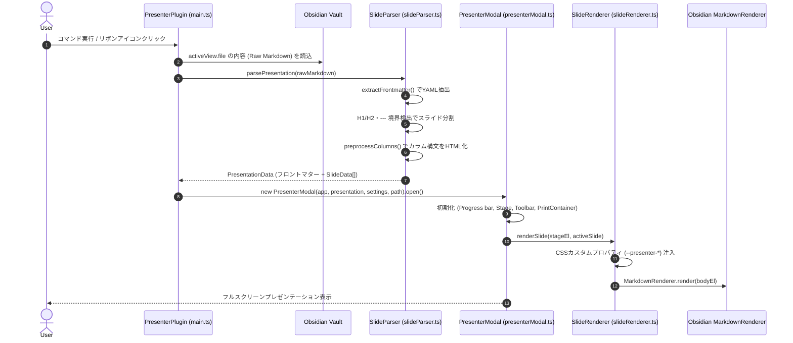

# システムアーキテクチャ設計書 (System Architecture Document)

## 1. 概要 (Overview)

本ドキュメントは、Obsidian用スライドプレゼンテーションプラグイン `obsidian-presenter` の全体アーキテクチャ、コンポーネント構成、データフロー、およびライフサイクル管理について記述した設計書です。

### 1.1 目的

- Markdownノートの文章構造（H1/H2）をそのまま活かしたスライド変換とプレビュー機能の提供。
- フロントマターによる動的テーマ設定とマルチカラム（グリッドレイアウト）のサポート。
- 高度なパフォーマンス、メモリリークのない堅牢なリソース管理、およびオフライン動作の保証。

---

## 2. コンポーネント構成 (Component Architecture)

プラグインは単一責任の原則に基づき、以下のモジュール群に明確に分割されています。

```bash
src/
├── main.ts                  # プラグインエントリーポイント・ライフサイクル
├── types.ts                 # データ構造・インターフェース定義
├── settings.ts              # グローバル設定UI (PluginSettingTab)
├── parser/
│   └── slideParser.ts       # フロントマター抽出、スライド分割、カラム変換
└── ui/
    ├── presenterModal.ts    # プレゼンテーション全画面モーダル・操作制御
    └── slideRenderer.ts     # Markdownレンダリング、動的CSS変数・ヘッダー/フッター生成
```

### 2.1 コンポーネント関連図 (Component Relationship)

```mermaid
flowchart TD
    ObsidianApp[Obsidian Core App] --> PresenterPlugin[PresenterPlugin (main.ts)]
    PresenterPlugin --> Settings[PresenterSettingTab (settings.ts)]
    PresenterPlugin --> SlideParser[slideParser.ts]
    PresenterPlugin --> PresenterModal[PresenterModal (presenterModal.ts)]
    
    SlideParser --> Types[Data Models (types.ts)]
    PresenterModal --> SlideRenderer[slideRenderer.ts]
    SlideRenderer --> MarkdownRenderer[Obsidian MarkdownRenderer.render]
    SlideRenderer --> DOM[Slide Card DOM Structure]
    PresenterModal --> KeyNav[Keyboard & Navigation Controls]
    PresenterModal --> PrintManager[Print & PDF Export Engine]
```

---

## 3. データフロー (Data Flow)

### 3.1 プレゼンテーション開始シーケンス



---

## 4. ライフサイクル・リソース管理 (Lifecycle & Resource Management)

Obsidianコミュニティプラグインの品質ガイドラインに従い、メモリリークおよび不要なリスナーの残留を完全に防止する設計を採用しています。

### 4.1 プラグイン本体のライフサイクル (`PresenterPlugin`)

- **`onload()`**:
  - `loadSettings()` による保存済み設定の復元。
  - `addRibbonIcon()` によるプレゼン開始アイコンの登録。
  - `addCommand()` によるコマンドパレット連携（`MarkdownView` の存在を `checkCallback` で判定）。
  - `addSettingTab()` による設定タブの登録。
- **`onunload()`**:
  - Obsidian のコアライフサイクルによって登録済みリボン・コマンド・設定タブは自動破棄されます。

### 4.2 モーダル・ビューのライフサイクル (`PresenterModal`)

- **`onOpen()`**:
  - 内部コンポーネント `Component` の生成・ロード。
  - `window.addEventListener('keydown', this.keyHandler)` によるキー入力監視。
  - `ResizeObserver` を `stageEl` にアタッチし、ウィンドウリサイズ時のアスペクト比維持とスケーリングを自動追従。
  - バックグラウンドで全スライドを `.presenter-print-container` に非同期プリレンダリング（印刷・PDF出力用）。
- **`onClose()`**:
  - キーボードリスナーの安全な解除 (`removeEventListener`)。
  - `ResizeObserver` の切断 (`disconnect`)。
  - `this.component.unload()` による MarkdownRenderer 内部リスナーの確実なクリーンアップ。
  - コンテナ要素の破棄 (`this.contentEl.empty()`)。

---

## 5. レンダリング戦略と互換性 (Rendering Strategy)

1. **Obsidian Native MarkdownRenderer の利用**:
   サードパーティのMarkdownパーサー（markdown-itやmarked等）をバンドルせず、Obsidian組み込みの `MarkdownRenderer.render` を使用しています。
   - メリット:
     - Obsidianの内部リンク `[[...]]`、画像埋め込み `![[...]`、Callout、MathJax、Mermaid、Code Highlightがそのまま動作。
     - プラグインバンドルサイズが極小（14KB）になり、起動負荷がゼロ。
2. **非破壊的前処理 (Non-destructive Preprocessing)**:
   Markdownの元ファイルを変更することは一切なく、メモリ上でスライド分割・カラムタグ置換を行いレンダリングします。
3. **オフライン・セキュリティ原則**:
   外部ネットワーク通信を一切行わず、Vault内のみで完結する安全設計です。
